# Microsoft Sentinel SOC Detection and Triage Lab

> End-to-end SOC investigation using Microsoft Sentinel, Azure Log Analytics and KQL, covering log ingestion, threat hunting, scheduled detection, incident triage, MITRE ATT&CK mapping and reporting.

## Project Summary

I deployed Microsoft Sentinel, ingested 292 controlled SSH authentication events and developed nine KQL hunting and investigation queries.

I converted the detection logic into a scheduled analytics rule and investigated three resulting incidents:

- Confirmed SSH account compromise
- Password-spray attempt
- Benign automated backup failure

The project demonstrates that alert volume alone does not determine severity: the highest-volume source was benign, while a lower-volume source successfully compromised an account.

## Quick Links

- [View KQL Queries](queries/)
- [Read the Detection and Response Report](report/detection-and-response-report.md)
- [View Investigation Evidence](screenshots/)
- [View the Sentinel Workbook](#sentinel-workbook)

## Key Outcomes

The detection identified three suspicious source IP addresses:

| Source IP | Activity | Verdict |
|---|---|---|
| `203.0.113.77` | Repeated failures followed by a successful SSH login and access to `/etc/shadow` | True Positive — Confirmed compromise |
| `198.51.100.23` | One external source targeting 11 different accounts | True Positive — Password-spray attempt |
| `10.20.14.9` | Internal backup service retrying an outdated password every 60 seconds | Benign Positive — Misconfigured backup job |

## Tools and Skills

**SIEM and Cloud**
- Microsoft Sentinel
- Azure Log Analytics
- Azure Monitor Logs Ingestion API
- Data Collection Endpoints and Data Collection Rules

**Detection and Investigation**
- Kusto Query Language
- Threat hunting
- Scheduled analytics rules
- Entity mapping and alert grouping
- Incident triage and classification
- Detection tuning
- MITRE ATT&CK mapping

**Reporting and Visualisation**
- Microsoft Sentinel Workbooks
- Evidence-based incident reporting
- Remediation recommendations
- Azure resource cleanup

**Supporting Tools**
- PowerShell
- Azure Cloud Shell
- Git and GitHub

## Architecture and Workflow

The project followed the complete SOC lifecycle:

```mermaid
flowchart LR
    A[SSH Authentication Logs] --> B[Azure Logs Ingestion API]
    B --> C[Data Collection Endpoint]
    C --> D[Data Collection Rule]
    D --> E[Log Analytics Workspace]
    E --> F[Microsoft Sentinel]
    F --> G[KQL Threat Hunting]
    G --> H[Scheduled Analytics Rule]
    H --> I[Sentinel Incidents]
    I --> J[Investigation and Triage]
    J --> K[Classification and Closure]
    K --> L[Workbook Dashboard and Report]
```

### Workflow

1. **Ingest** — Loaded the controlled SSH dataset into the custom `MeridianLogs_CL` table.
2. **Inspect** — Reviewed the raw fields and original authentication events.
3. **Hunt** — Used KQL to extract source IP addresses, usernames and authentication outcomes.
4. **Detect** — Created a scheduled rule for sources generating more than five failed SSH logins within a 10-minute window.
5. **Alert** — Mapped source IPs as entities and generated separate Sentinel incidents.
6. **Triage** — Investigated each incident to determine whether authentication succeeded and what occurred afterward.
7. **Classify** — Closed two incidents as true positives and one as a benign positive.
8. **Visualise** — Built a Sentinel workbook showing failed logins over time and the top source IPs.
9. **Report** — Documented the evidence, MITRE ATT&CK mappings, remediation and detection limitations.
10. **Clean up** — Deleted the Azure resource group after preserving the project evidence.

## What I Built

- A Microsoft Sentinel deployment connected to an Azure Log Analytics workspace
- A custom Log Analytics table containing SSH authentication activity
- A Data Collection Endpoint and Data Collection Rule
- Nine documented KQL threat-hunting and investigation queries
- A scheduled brute-force analytics rule
- IP entity mapping and alert grouping
- Three fully investigated Sentinel incidents
- A workbook dashboard for authentication monitoring
- A detailed detection-and-response report
- A redacted evidence set for portfolio publication

## Data Ingestion Troubleshooting

The original legacy ingestion script returned successful HTTP responses but did not populate the custom table.

To resolve the issue, I:

1. Verified the workspace ID and destination table.
2. Confirmed that the custom table was provisioned successfully.
3. Tested ingestion with a single controlled record.
4. Migrated the table from classic ingestion to Data Collection Rule-based ingestion.
5. Created a Data Collection Endpoint and Data Collection Rule.
6. Assigned the required Azure role.
7. Authenticated to the Azure Monitor API.
8. Successfully ingested the dataset using the current Logs Ingestion API.

This troubleshooting provided practical experience with Azure authentication, permissions, custom tables and modern log-ingestion pipelines.

## Detection Evidence

### Suspicious Sources Identified

The first hunting query grouped failed SSH authentication attempts by source IP. Three sources stood out significantly above the normal background activity.

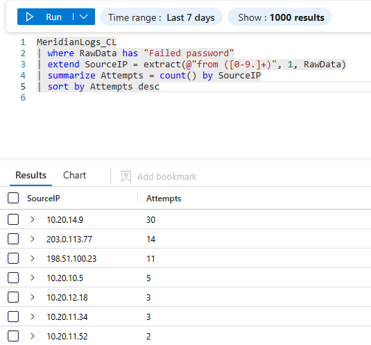

### Scheduled Analytics Rule

The hunting logic was converted into an enabled Microsoft Sentinel scheduled analytics rule with Medium severity.

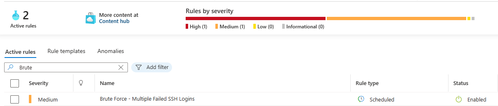

### Incidents Generated

The rule generated separate incidents for the three suspicious source IP addresses.

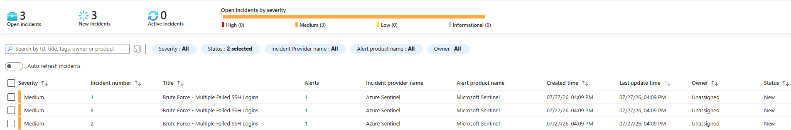

### Confirmed Account Compromise

Investigation of `203.0.113.77` showed repeated failed authentication attempts followed by a successful SSH login to the `opsadmin` account.

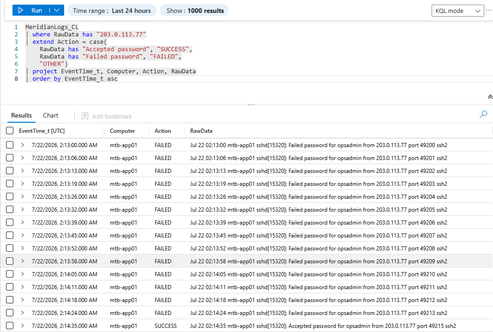

The investigation also identified post-compromise access to the Linux password-hash file.

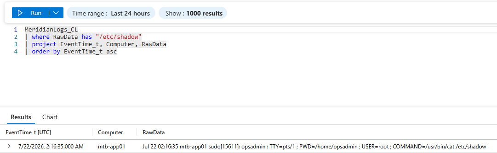

### Password-Spray Attempt

The source `198.51.100.23` attempted authentication against 11 different usernames, with no successful login.

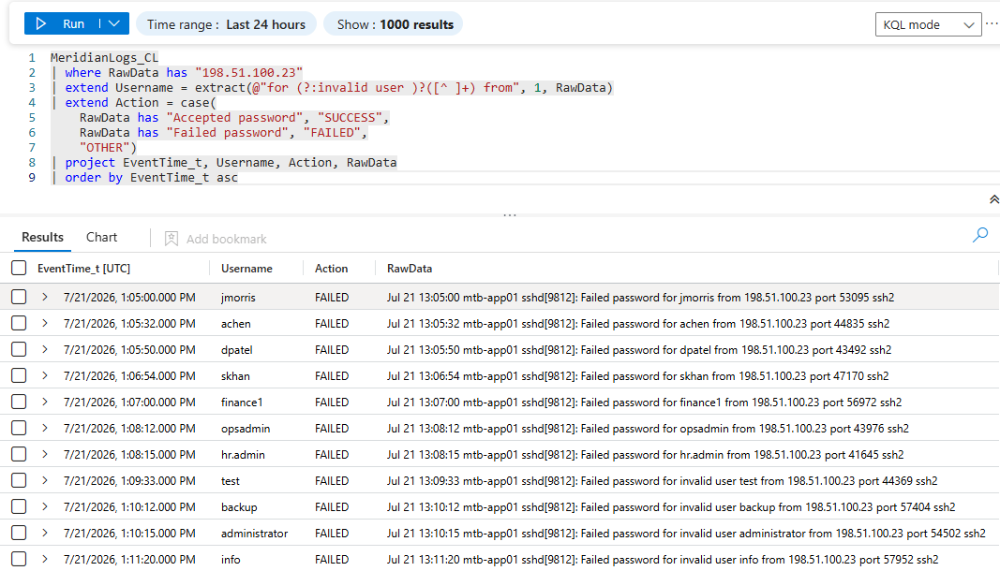

### Benign Backup-Service Activity

The internal source `10.20.14.9` generated 30 failed attempts against `svc-backup`, with no successful authentication and an exact 60-second interval between attempts.

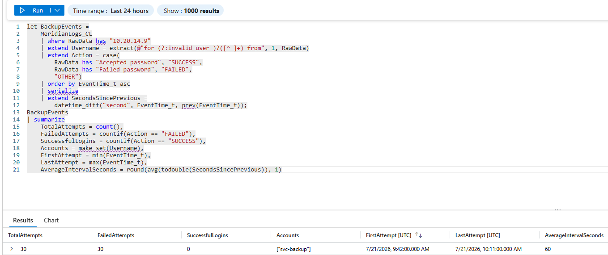

### Completed Incident Queue

All primary incidents were investigated, classified, documented and closed.

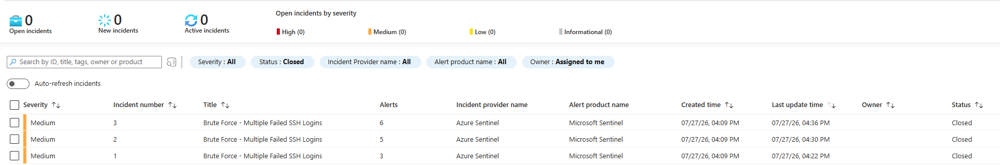

### Sentinel Workbook

A custom workbook was created to visualise failed SSH logins over time and rank the top source IP addresses.

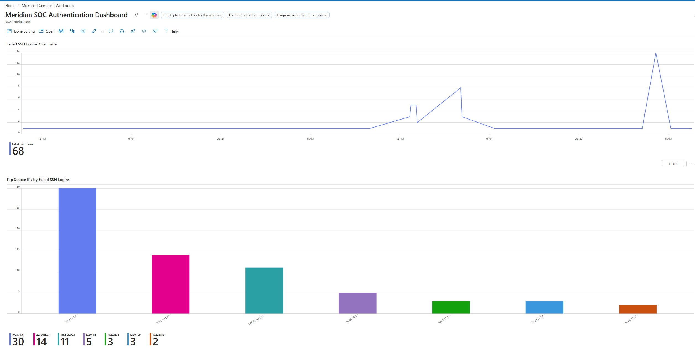

## KQL Queries

The complete KQL used during the project is available in the [`queries`](queries/) directory.

| File | Purpose |
|---|---|
| [`01-raw-log-inspection.kql`](queries/01-raw-log-inspection.kql) | Inspect the custom table structure and sample raw events |
| [`02-failed-logins-by-ip.kql`](queries/02-failed-logins-by-ip.kql) | Count and rank failed logins by source IP |
| [`03-brute-force-detection.kql`](queries/03-brute-force-detection.kql) | Detect more than five failures within a 10-minute window |
| [`04-confirmed-compromise-investigation.kql`](queries/04-confirmed-compromise-investigation.kql) | Reconstruct failures followed by successful authentication |
| [`05-post-compromise-shadow-access.kql`](queries/05-post-compromise-shadow-access.kql) | Identify access to `/etc/shadow` |
| [`06-password-spray-investigation.kql`](queries/06-password-spray-investigation.kql) | Extract usernames targeted by the password spray |
| [`07-benign-backup-investigation.kql`](queries/07-benign-backup-investigation.kql) | Summarise the automated backup retry pattern |
| [`08-failed-logins-over-time.kql`](queries/08-failed-logins-over-time.kql) | Power the workbook authentication timeline |
| [`09-top-source-ips.kql`](queries/09-top-source-ips.kql) | Power the workbook source-IP ranking |

## Investigation Report

The full detection-and-response report contains the incident evidence, analyst decisions, MITRE ATT&CK mapping, remediation recommendations, detection limitations and lessons learned.

[Read the full Detection and Response Report](report/detection-and-response-report.md)

## MITRE ATT&CK Mapping

| Technique | Name | Project Evidence |
|---|---|---|
| `T1110` | Brute Force | Repeated failed SSH logins against the `opsadmin` account |
| `T1110.003` | Password Spraying | One external IP attempted authentication against 11 different usernames |
| `T1078` | Valid Accounts | The attacker successfully authenticated using the `opsadmin` account |
| `T1003.008` | OS Credential Dumping: `/etc/passwd` and `/etc/shadow` | The compromised account accessed `/etc/shadow` after authentication |

## Detection Limitations

The scheduled analytics rule was effective at identifying concentrated failed-login activity, but it has several limitations:

- Low-and-slow attacks may remain below the threshold of more than five failures within 10 minutes.
- IP-based grouping may miss attackers who rotate source addresses.
- Shared proxies or NAT gateways may cause multiple systems to appear under one source IP.
- The rule does not independently determine whether activity is malicious or benign.
- The rule does not directly correlate failed attempts with a later successful login.
- The lab used a static imported dataset rather than a continuous production data connector.
- Repeated evaluation of the same static records generated duplicate incidents.
- The available telemetry was limited to one fictional Linux server.

A production implementation should combine this rule with identity, endpoint, firewall, network and cloud audit logs.

## What I Would Improve in Production

- Create a higher-severity rule for repeated failures followed by successful authentication.
- Add a password-spray rule based on the number of unique accounts targeted by one source.
- Add a low-and-slow detection using a longer analysis period.
- Tune thresholds using historical authentication baselines.
- Use continuous data connectors instead of manual log ingestion.
- Add alert suppression and deduplication.
- Correlate authentication events with process-execution and endpoint telemetry.
- Enrich source IP entities with threat-intelligence information.
- Automate containment actions only after appropriate validation.
- Track detection performance using false-positive and false-negative reviews.

## Repository Structure

```text
microsoft-sentinel-soc-lab/
├── README.md
├── .gitignore
├── queries/
│   ├── 01-raw-log-inspection.kql
│   ├── 02-failed-logins-by-ip.kql
│   ├── 03-brute-force-detection.kql
│   ├── 04-confirmed-compromise-investigation.kql
│   ├── 05-post-compromise-shadow-access.kql
│   ├── 06-password-spray-investigation.kql
│   ├── 07-benign-backup-investigation.kql
│   ├── 08-failed-logins-over-time.kql
│   └── 09-top-source-ips.kql
├── report/
│   └── detection-and-response-report.md
└── screenshots/
    ├── 01-sentinel-enabled.png
    ├── 02-log-ingestion-confirmed.png
    ├── 03-raw-log-sample.png
    ├── 04-failed-logins-by-source-ip.png
    ├── 06-analytics-rule-enabled.png
    ├── 07-sentinel-incidents-generated.png
    ├── 08-incident-details-confirmed-compromise.png
    ├── 09-confirmed-compromise-success-login.png
    ├── 10-post-compromise-shadow-file-access.png
    ├── 11-confirmed-compromise-closed.png
    ├── 13-password-spray-evidence.png
    ├── 14-password-spray-closed.png
    ├── 15-incident-details-benign-backup.png
    ├── 16-benign-backup-job-evidence.png
    ├── 17-benign-backup-incident-closed.png
    ├── 18-incidents-triaged-and-closed.png
    ├── 19-sentinel-workbook-dashboard.png
    └── 20-resource-group-deleted.png
```

## Responsible Use and Attribution

This project was completed in an authorised lab environment using a fictional banking scenario and controlled training data.

The original scenario and sample dataset were supplied through the MyFirstHack Mentorship Weekly Project 05 material. The Azure deployment, ingestion troubleshooting, KQL analysis, detection configuration, incident investigation, written report and redacted screenshots were completed as part of my own lab work.

The original dataset, training guide, ingestion scripts, credentials and unredacted evidence are not included in this repository.

## Cloud Cleanup

After preserving the required project evidence, the Azure resource group was deleted.

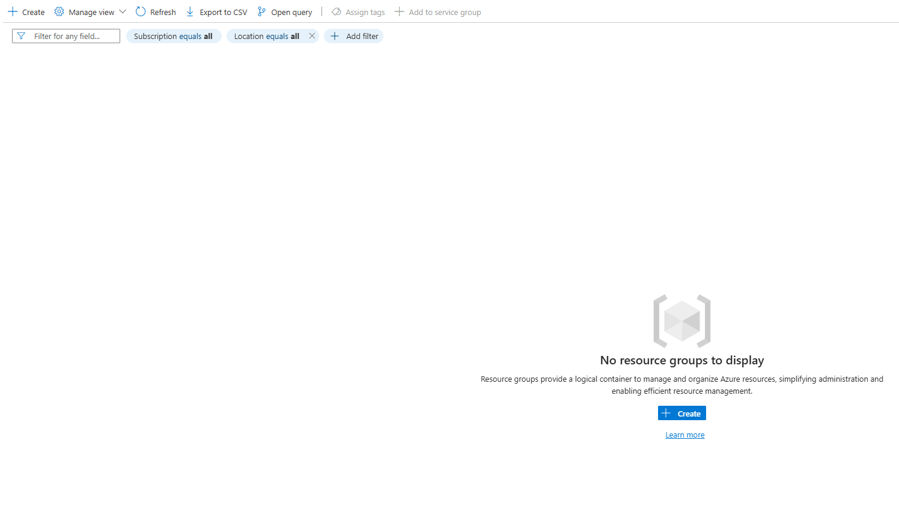

This removed the Sentinel deployment, Log Analytics workspace, custom table, analytics rule, incidents, workbook, Data Collection Endpoint and Data Collection Rule.

## Key Takeaway

The most important lesson from this project was that alert volume does not equal severity.

The highest-volume source was a benign backup process, while a lower-volume source successfully compromised an account and accessed sensitive credential data. Effective SOC analysis therefore requires evidence-based investigation, contextual reasoning and clear documentation rather than relying only on alert counts.
